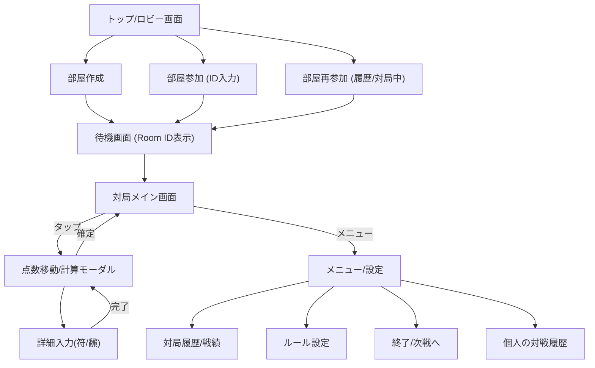

# 麻雀点数管理アプリ 外部設計書

## 1. システム構成・技術スタック

### 1.1 アーキテクチャ概要

本アプリは**Single Page Application (SPA)**として構築し、データの永続化およびリアルタイム同期には**BaaS (Backend as a Service)**を利用するサーバーレス構成とする。

### 1.2 採用技術スタック

- **Frontend Framework**: **React** (Vite環境)
  - 高速な動作とコンポーネント指向による開発効率のため。
- **Language**: **TypeScript**
  - 型安全性によるバグ抑制と保守性向上のため。
- **Styling**: **Vanilla CSS** (CSS Variables活用)
  - 専用のデザインシステムを構築し、柔軟かつ軽量なUIを実現する。
- **State Management**: **React Context API + Hooks**
- **Infrastructure / Realtime DB**: **Firebase**
  - **Hosting**: アプリ配信。
  - **Firestore**: ゲーム状態の保存（NoSQL）。
  - **Authentication**: 匿名認証（ログイン不要で即利用開始）またはGoogleログイン。
  - 採用理由: 無料枠が大きく、リアルタイムリスナー機能(onSnapshot)が標準で備わっており、実装コストが低い。

## 2. 画面設計 (UI/UX)

### 2.1 画面遷移図

### 2.2 主要画面構成

#### (1) 対局メイン画面 (Main Board)

- **盤面情報エリア (Center)**:
  - 局数 (例: 東1局 1本場)
  - 供託 (リーチ棒) 本数・点数
  - ドラ表示
  - 親マーカー
- **プレイヤー情報エリア (4隅またはリスト)**:
  - プレイヤー名
  - 現在点数 (増減アニメーション対応)
  - 起家マーク
  - リーチ状態表示
- **操作アクション**:
  - 各プレイヤーエリアをタップ → 「ロン」「ツモ」「リーチ」等のアクションメニュー展開
  - 中央エリアをタップ → 「流局」「本場修正」メニュー

#### (2) 点数計算・入力画面 (Scoring Modal)

- **アガリ入力フロー**:
  - Step 1: アガリ種別 (ロン / ツモ)
  - Step 2: 誰が (アガリ者)、誰から (放銃者 - ロンの場合)
  - Step 3: 点数選択
    - **簡易入力**: 満貫 / 跳満 / 倍満 / 三倍満 / 役満
    - **詳細入力**: 飜数 (1~13+)、符数 (20~110)
    - **符計算なしモード**: 1-3翻選択時は符数選択をスキップ。4翻選択肢を除外(満貫へ誘導)。
  - Step 4: オプション (チップ枚数、積み棒精算確認)
  - Step 5: 確定ボタン (点数移動実行)

#### (3) 戦績・セット管理画面 (Result View)

- 現在のセット内の全対局スコア一覧表。
- トータル収支 (ウマ・オカ適用後)。
- チップ累計。
- **アクション**:
  - 「次の対局へ」: 全員の準備完了で次の半荘へ移行。
  - 「対局を終了」: 現在の対局を完全に終了し、結果を確定(Read-only化)してトップへ戻る。

## 3. データフロー・同期設計

### 3.1 状態管理サイクル

1. **User Action**: ユーザーが操作(点数入力など)。
2. **Update**: Firestoreのドキュメントを更新。
3. **Sync**: 全クライアントがFirestoreの変更を検知(onSnapshot)。
4. **Render**: 新しい状態に基づいてUIを再描画。

### 3.2 データモデル案 (Firestore)

- collection: `rooms`
  - document: `{roomId}`
    - `status`: "waiting" | "playing" | "finished"
    - `rule`: { ... } (3麻/4麻, チップ有無など)
    - `players`: [ { name, score, chip, isRiichi, wind } ... ]
    - `round`: { wind: "East", number: 1, honba: 0, kyoutaku: 0 }
    - `logs`: [ { type: "win", from, to, score, ... } ... ] (履歴)
    - `set_history`: [ { scores: [...], ... } ] (連続対局用)

## 4. UIデザイン方針

- **モバイルファースト**: スマートフォンでの縦画面操作を最優先。
- **ダークモード**: バッテリー消費抑制と「雀荘の雰囲気」演出のため、暗色ベースの配色。
- **視認性重視**: 数字(点数)は大きく、コントラストを高く。
- **誤操作防止**: 重要な点数移動は「選択→確認」の2ステップとし、さらに**直前の操作を取り消せる「Undo機能」**を実装する。
