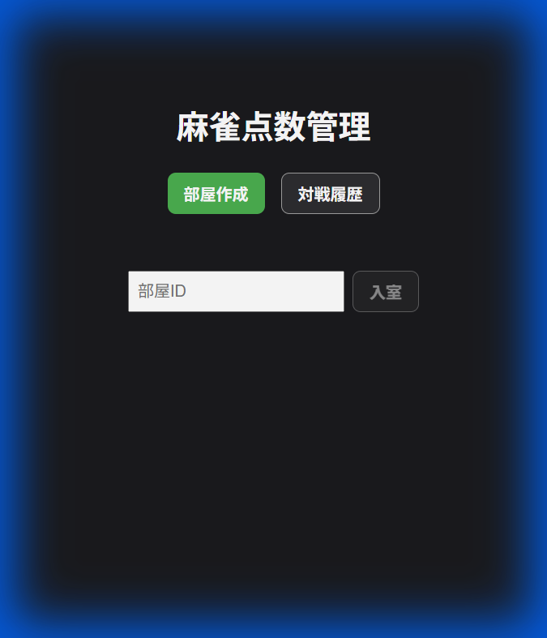
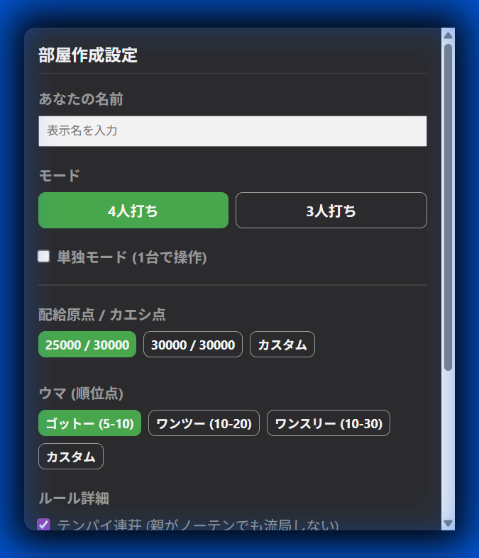
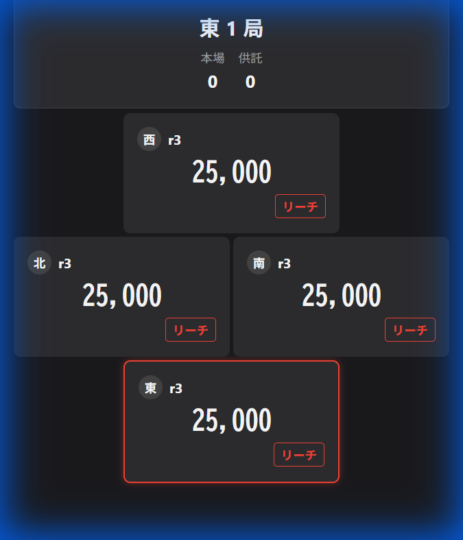
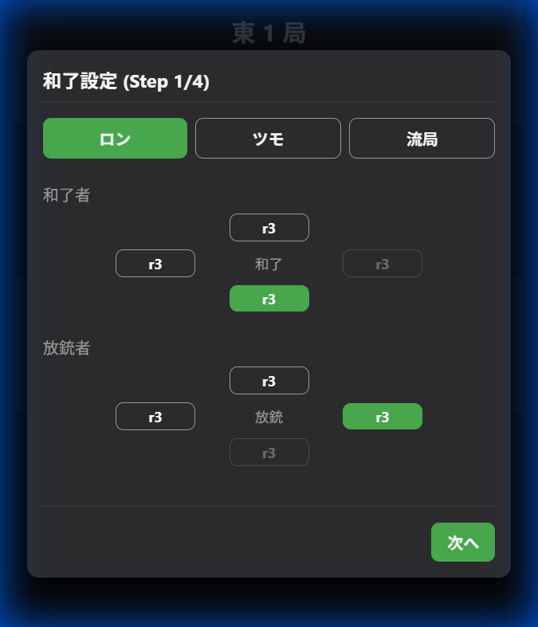
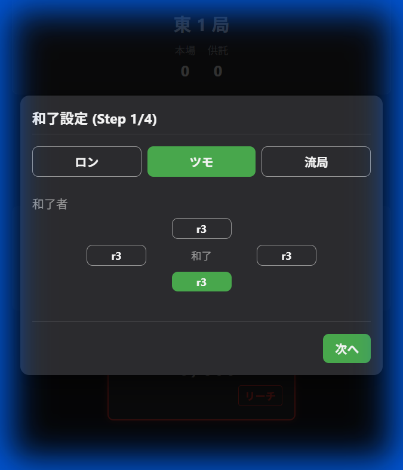

# 麻雀点数管理アプリ ユーザーマニュアル

このマニュアルでは、麻雀点数管理アプリ（[https://mj.h-kohara.com](https://mj.h-kohara.com)）の基本的な使い方について解説します。

## 1. はじめに

本アプリは、ブラウザ上で麻雀の点数管理を行うためのツールです。
参加者全員がそれぞれのスマホで操作する「同期モード」と、1台の端末で管理する「単独モード」に対応しており、4人打ち・3人打ちの両方をサポートしています。

## 2. アプリへのアクセスとホーム画面

アプリのURL（[https://mj.h-kohara.com](https://mj.h-kohara.com)）にアクセスすると、以下のホーム画面が表示されます。

主な機能は以下の通りです。

- **部屋作成**: 新しく対局ルームを作成します。
- **対戦履歴**: 過去の対局履歴を確認できます。
- **部屋ID入力**: 友人が作成した部屋に参加する場合、ここに部屋IDを入力して参加します（同期モード時）。

## 3. 部屋の作成と設定

「部屋作成」ボタンを押すと、対局の設定画面が表示されます。

### 3.1 プレイヤーとモード設定

- **単独モード**: 1台の端末で全プレイヤーの点数を操作する場合にチェックを入れます。
  - チェックを入れると、同席するプレイヤー全員の名前を入力できます。
  - チェックを外すと、自分以外のプレイヤーはそれぞれの端末から部屋に参加してもらう形式（同期モード）になります。
- **プレイヤー名**: 自分の表示名を入力します。

### 3.2 ルール設定

対局の詳細なルールを設定できます。

- **人数**: 4人 / 3人 を選択します。
- **点数設定**: 配給原点、カエシ点（精算基準点）を設定できます。
- **ウマ**: 順位点を設定します（例: 10-30、沈みウマなど）。
- **詳細設定**:
  - **テンパイ連荘**: 流局時に親が聴牌していれば連荘するかどうか。
  - **トビ終了**: 点数が0未満（または以下）になった時点でゲーム終了とするか。
  - **チップ**: チップの枚数管理を行うかどうか。

全ての設定が完了したら、画面下部の「部屋作成」ボタン（緑色）を押して対局を開始します。

## 4. 対局画面の操作

### 4.1 基本画面

対局画面では、現在の局、本場、供託（リーチ棒）、全員の持ち点が表示されます。

### 4.2 点数の入力フロー

点数の入力は、対象となるプレイヤーの点数部分をタップすることで開始します。

**A. ロン（放銃）の場合**
放銃したプレイヤー（振り込んだ人）の点数をタップします。

1. **放銃者の選択**: 点数をタップしたプレイヤーが放銃者として選択された状態で入力画面が開きます。
2. **点数入力**: 符数・翻数を選択するか、直接点数を入力して確定します。

**B. ツモ（自摸）の場合**
自身の点数をタップします。

1. **ツモ**: 自身の点数をタップすると、自動的にツモあがりとして入力画面が開きます。
2. **点数入力**: 点数を選択して確定します。

### 4.3 その他の操作

- **流局**: アガリが発生せず局が終了した場合、「流局」ボタンを押します。
- **リーチ**: リーチをしたプレイヤーは、リーチボタンを押すことで1000点を供託に出します。

## 5. 対局の終了

対局が終了条件（オーラス終了やトビなど）を満たすと、結果画面が表示されます。
「対戦履歴」メニューからは、過去のゲームの結果や点数推移を確認することができます。
