# 麻雀点数管理アプリ ユーザーマニュアル

このマニュアルでは、麻雀点数管理アプリの現行機能に合わせて、トップ画面から通常対局、大会機能までの基本的な使い方をまとめます。

アプリの公開 URL は [https://mj.h-kohara.com](https://mj.h-kohara.com) です。

## 1. はじめに

本アプリは、ブラウザ上で麻雀の点数管理を行うためのツールです。主に次の 3 つの使い方に対応しています。

- **同期モード**: 参加者がそれぞれの端末から同じ部屋に入り、待機ルームを経由して対局を始めます。
- **単独モード**: 1 台の端末で 4 人分または 3 人分の点数をまとめて操作します。
- **大会機能**: 参加者管理、卓管理、ライブビュー、レポート確認を行います。

## 2. トップ画面とアカウント

トップ画面では、通常対局と大会の両方の入口にアクセスできます。

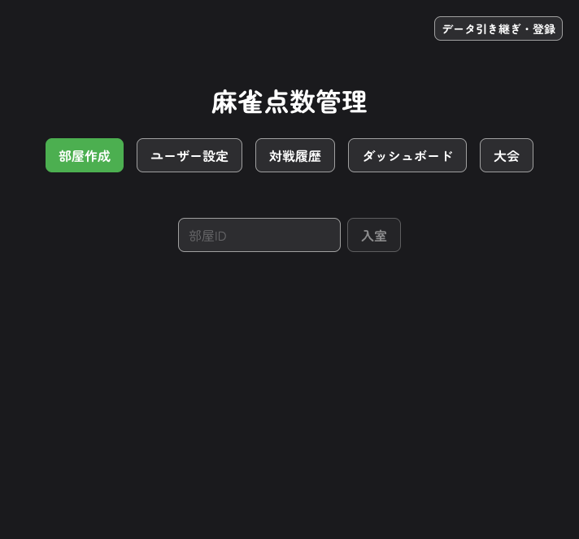

トップ画面の主な項目は次の通りです。

- **部屋作成**: 通常対局の部屋を新規作成します。
- **ユーザー設定**: 表示名やデフォルトルールを保存します。
- **対戦履歴**: 過去に参加した対局を確認します。
- **ダッシュボード**: 個人戦績を確認します。
- **大会**: 大会一覧、大会作成、大会ダッシュボードに進みます。
- **部屋ID入力 / 入室**: 同期モードの部屋に参加するときに使います。

画面右上にはアカウント関連の導線があります。

- 匿名利用中は **データ引き継ぎ・登録** が表示され、匿名ユーザーの戦績や設定をメールアドレスのアカウントへ引き継げます。
- ログイン済みの場合はメールアドレスと **ログアウト** が表示されます。

## 3. ユーザー設定

ユーザー設定では、表示名とデフォルトルールを UID ごとに保存できます。

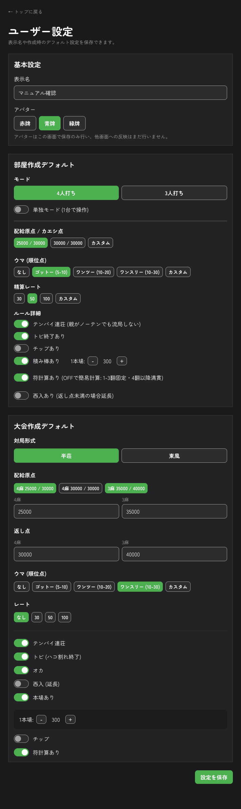

保存できる主な内容は次の通りです。

- **表示名**: 部屋作成や大会作成の初期値として使われます。
- **アバター**: 現在はこの画面で保存のみ行い、他画面にはまだ反映されません。
- **部屋作成デフォルト**: 通常対局の部屋作成モーダルを開いたときの初期値になります。
- **大会作成デフォルト**: 大会作成画面を開いたときの初期値になります。

部屋作成デフォルトと大会作成デフォルトでは、次のようなルール設定を保存できます。

- モードや対局形式
- 原点、返し点、ウマ、レート
- テンパイ連荘、トビ、本場、符計算、西入、チップ などの詳細設定

## 4. 通常対局

### 4.1 部屋を作成する

トップ画面の **部屋作成** を押すと、部屋作成設定モーダルが開きます。

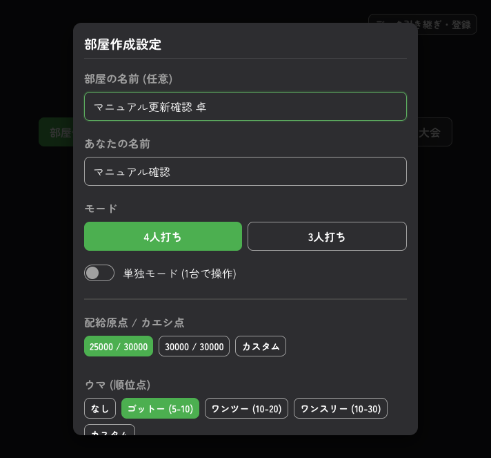

設定できる主な項目は次の通りです。

- **部屋の名前 (任意)**: 履歴や一覧で識別しやすくなります。
- **あなたの名前**: 自分の表示名です。ユーザー設定の表示名が初期値に入ります。
- **モード**: 4 人打ち / 3 人打ちを切り替えます。
- **単独モード (1台で操作)**: ON にすると、同じ端末で他プレイヤー名もまとめて入力できます。
- **ルール設定**: 原点、返し点、ウマ、レート、テンパイ連荘、トビ、チップ、符計算、西入などを設定できます。

単独モードを ON にすると、他プレイヤー名の入力欄が追加されます。入力がそろったら **部屋作成** を押します。

### 4.2 待機ルーム

部屋作成後は待機ルームに進みます。同期モードでは参加者がここで合流し、単独モードでは入力した全員があらかじめ待機ルームに並びます。

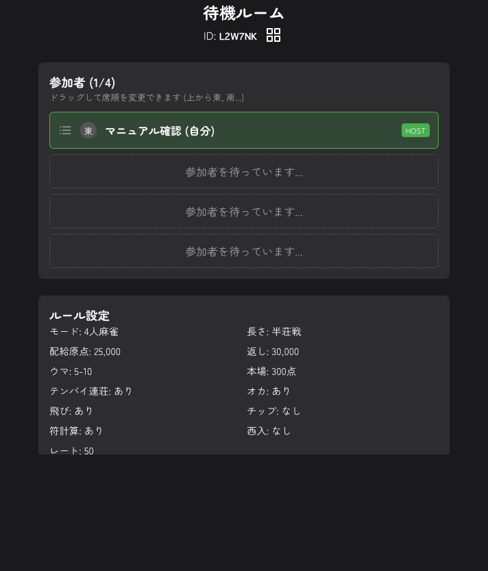

待機ルームでできることは次の通りです。

- **部屋IDの共有**: 画面上部に部屋 ID が表示されます。
- **QR 共有**: QR アイコンを押すと参加用リンクを QR コードで表示できます。
- **席順変更**: ホストは参加者カード左側のハンドルをドラッグして席順を変更できます。
- **ルール確認**: 現在のルール設定を一覧で確認できます。
- **ゲーム開始**: 必要人数がそろうとホストがゲームを開始できます。

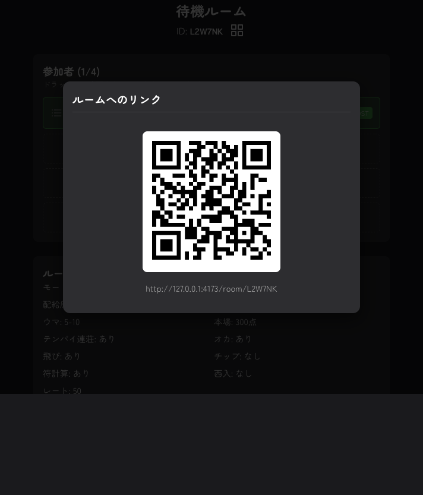

### 4.3 対局画面

ゲーム開始後は対局画面に切り替わります。

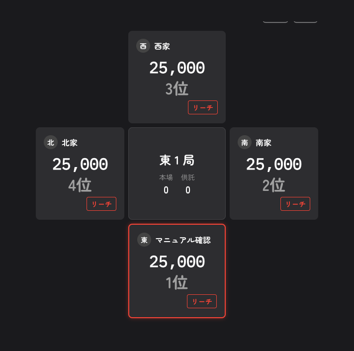

対局画面の見方は次の通りです。

- 画面中央上部に **局数、本場、供託** が表示されます。
- 各プレイヤーカードに **風、名前、現在点数、順位** が表示されます。
- 各プレイヤーの **リーチ** ボタンを押すと、そのプレイヤーがリーチ状態になります。
- 1 回でも操作すると **Undo** が表示され、直前の状態に戻せます。

上部のボタンから行える操作は次の通りです。

- **Share**: 現在の対局 URL をコピーします。
- **Menu**: SE の ON/OFF、対局内の戦績確認、途中終了、トップへの移動ができます。

### 4.4 点数入力フロー

点数入力は、プレイヤーカードを押して開始します。現行 UI は「誰が和了したか」「誰が放銃したか」を先に決める方式です。

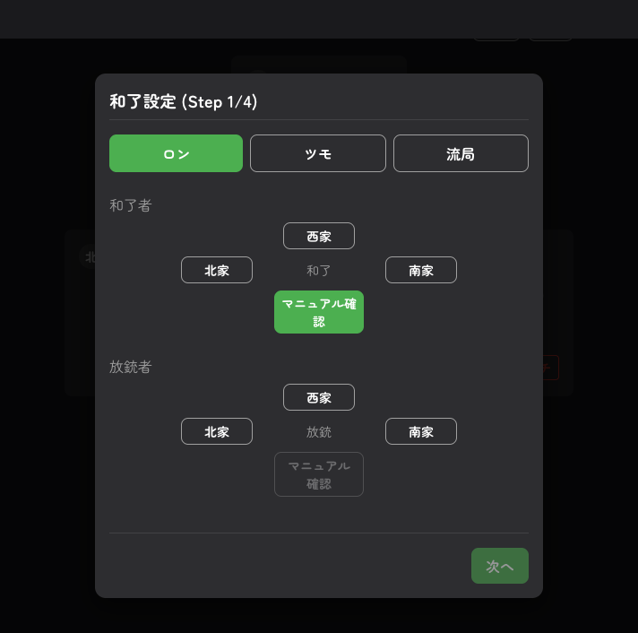

入力の流れは次の通りです。

1. **和了種別を選ぶ**

- **ロン**
- **ツモ**
- **流局**

1. **和了者を選ぶ**

- ロンでは複数和了にも対応します。

1. **放銃者を選ぶ**

- ロンのときだけ選択します。

1. **飜数や符数を選ぶ**

- 満貫、跳満、倍満、三倍満、役満以上も直接選べます。

1. **確認して確定する**

補足:

- **流局** を選ぶと、聴牌者を選ぶ流局入力画面に切り替わります。
- **符計算あり** のルールでは、飜数のあとに符数選択があります。
- **符計算なし** のルールでは、簡易計算で確定します。

### 4.5 対局の終了、次の対局、精算

対局が終了すると結果画面が表示されます。途中終了を **成績に反映して終了** した場合も、結果画面に進みます。

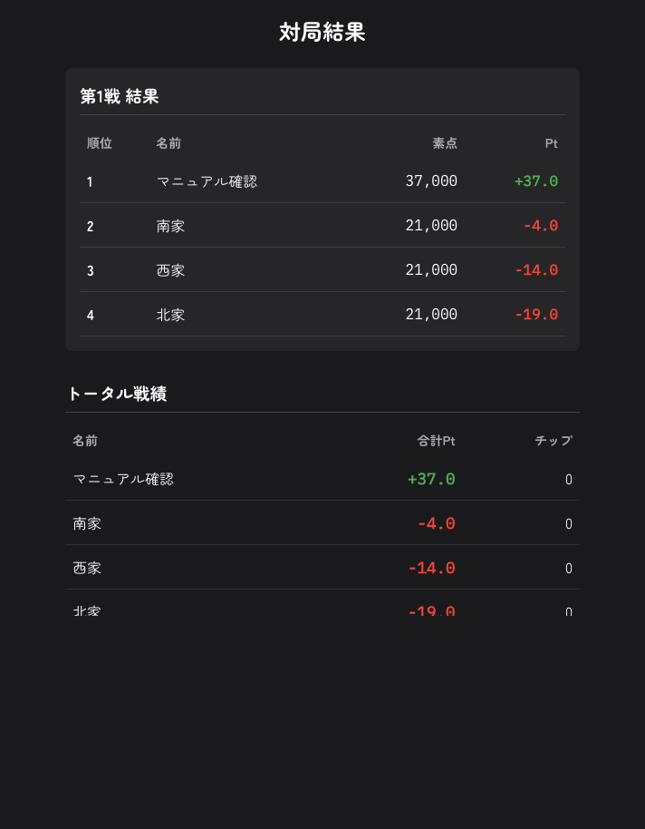

結果画面では次のことができます。

- **第 n 戦 結果**: その対局の順位、素点、Pt を確認できます。
- **トータル戦績**: 連戦している場合の累計 Pt を確認できます。
- **次の対局へ**: 同じメンバー、同じ卓で次の対局を始めます。
- **対局を終了する**: 連戦を終了し、閲覧専用の状態へ進みます。

レートが設定されている場合は、対局終了時に精算画面が表示されます。

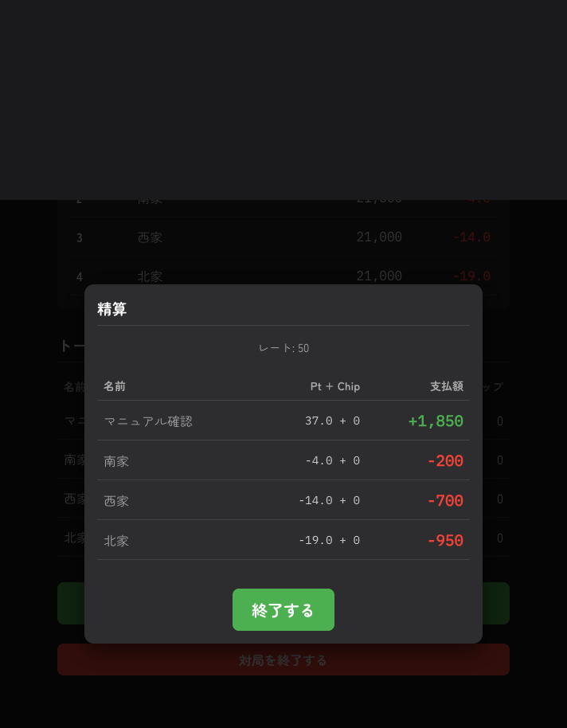

精算画面では Pt とチップをもとに支払額を確認できます。

## 5. 履歴とダッシュボード

### 5.1 対戦履歴

トップ画面の **対戦履歴** から、参加した部屋の一覧を確認できます。

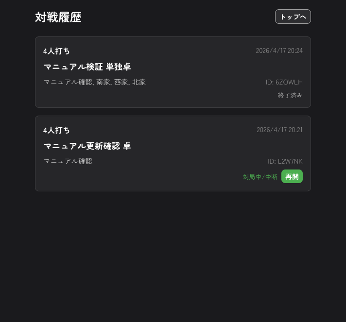

履歴一覧で確認できる内容は次の通りです。

- 対局形式
- 作成日時
- 部屋名
- 参加者名
- 部屋 ID
- **終了済み** または **対局中/中断** の状態

対局中または中断中の部屋には **再開** ボタンが表示されます。履歴カード自体を押すと対局詳細に進みます。

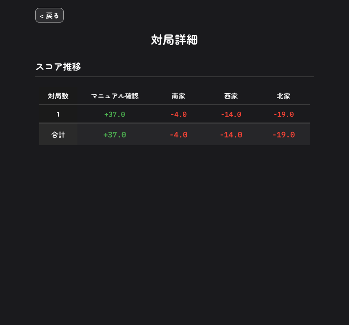

対局詳細では、各ゲームごとの Pt と合計 Pt の推移を確認できます。

### 5.2 ダッシュボード

トップ画面の **ダッシュボード** では、自分の個人戦績を確認できます。

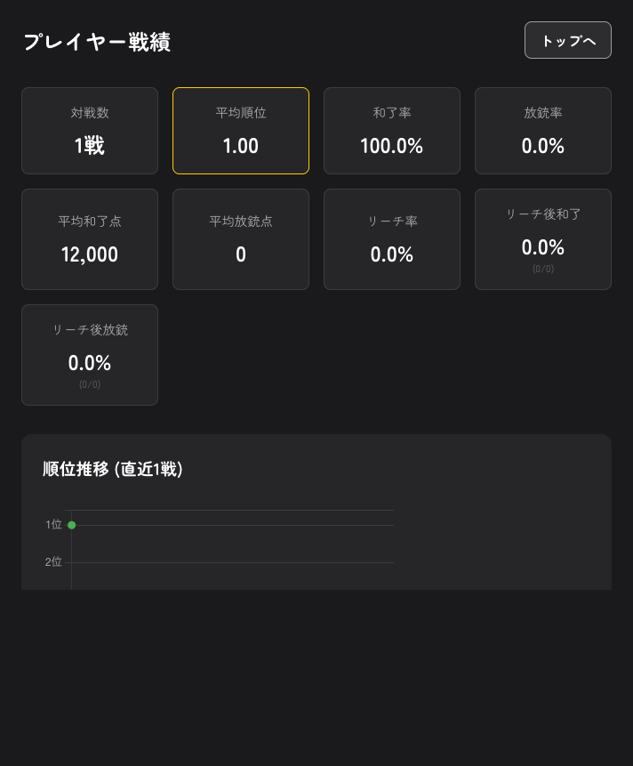

ダッシュボードで確認できる主な指標は次の通りです。

- 対戦数
- 平均順位
- 和了率
- 放銃率
- 平均和了点
- 平均放銃点
- リーチ率
- リーチ後和了率 / リーチ後放銃率
- 順位推移グラフ

## 6. 大会機能

### 6.1 大会一覧と大会作成

トップ画面の **大会** から大会一覧に進めます。大会がない場合はその場から新規作成できます。

大会作成画面では、通常対局とは別に大会用の初期ルールを保存・利用できます。

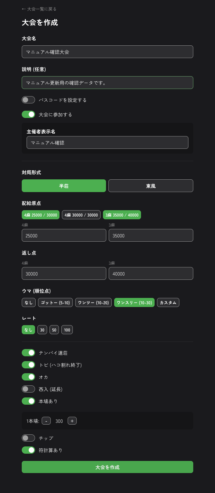

大会作成時の主な設定は次の通りです。

- **大会名 / 説明**
- **パスコードの有無**
- **大会に参加する**
- **主催者表示名**
- **大会ルール設定**

### 6.2 大会ダッシュボード

大会を作成すると大会ダッシュボードに進みます。

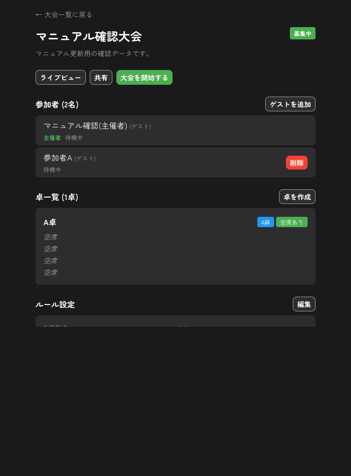

大会ダッシュボードでできることは次の通りです。

- **参加者管理**: 主催者や追加したゲストの状態を確認できます。
- **ゲスト追加**: その場で大会参加者を追加できます。
- **共同主催者**: 主催者は、大会の開始前・進行中を問わず、ユーザーIDと紐づく参加者を共同主催者に任命・解除できます。名前だけで追加したゲストは対象外です。
- **卓管理**: 卓を作成して一覧表示できます。
- **共有**: 参加用リンクを共有できます。
- **ライブビュー**: 会場向けの一覧表示に切り替えられます。
- **大会を開始する**: 募集中から進行中へ切り替えます。
- **ルール設定の編集**: 大会ルールを再編集できます。

卓作成では、卓名と 4 麻 / 3 麻を選択します。

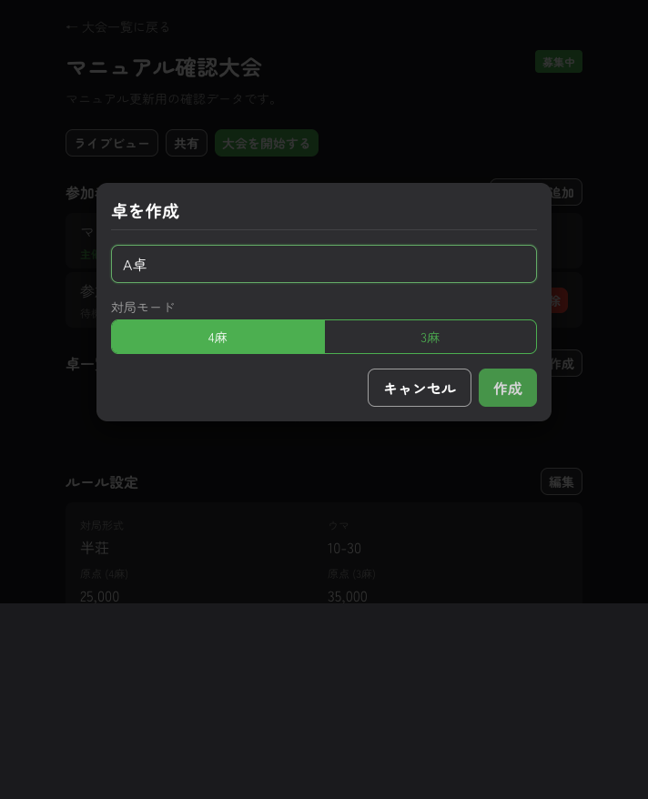

### 6.3 ライブビューとレポート

大会ダッシュボードから **ライブビュー** に進むと、卓の状況と総合成績を一覧で確認できます。

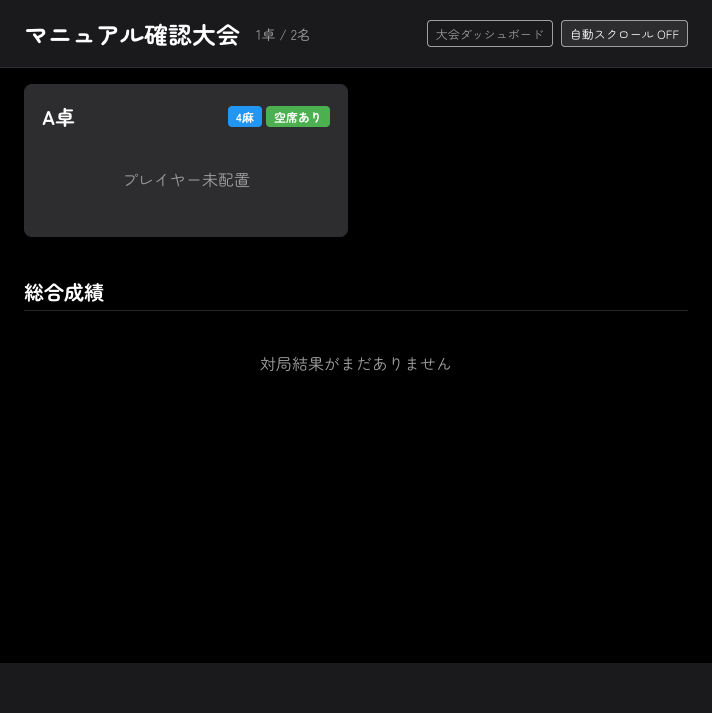

ライブビューでは次の内容を確認できます。

- 大会名、卓数、参加者数
- 各卓の状態
- 総合成績

対局結果がたまると、レポート画面から総合成績や卓別サマリを確認できます。結果がまだない場合は空の状態で表示され、CSV / PDF 出力は無効になります。

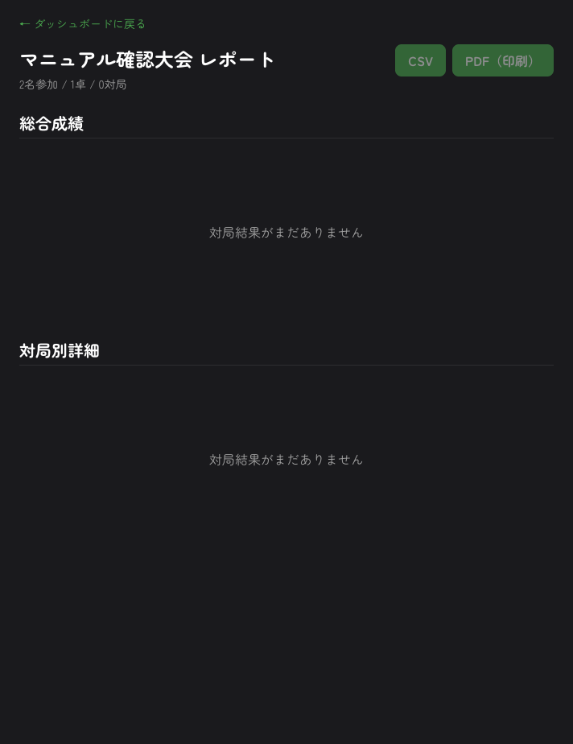

## 7. 使い方の流れまとめ

通常対局を始めるときは、次の流れが基本です。

1. ユーザー設定で表示名とデフォルトルールを保存する
2. トップ画面から部屋を作成する
3. 待機ルームで参加者をそろえ、必要なら席順を調整する
4. ゲーム開始後、プレイヤーカードから点数入力を行う
5. 対局終了後に結果、履歴、ダッシュボードを確認する

大会運用では、次の流れが基本です。

1. 大会を作成する
2. 大会ダッシュボードで参加者と卓を準備する
3. 必要に応じて共有リンクから参加者を集める
4. ライブビューやレポートで進行状況を確認する
